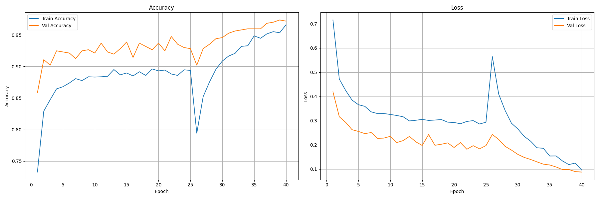
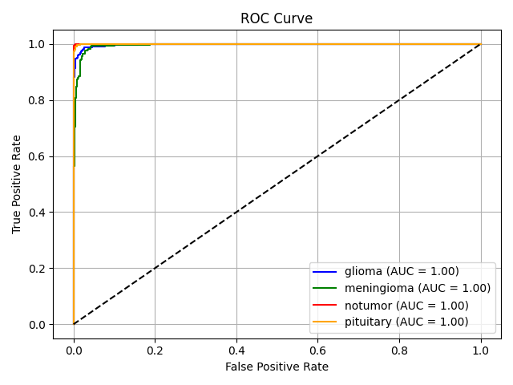
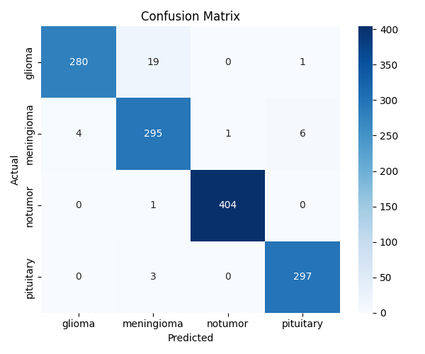
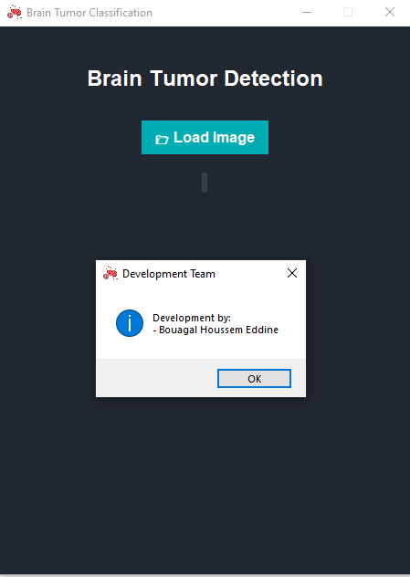
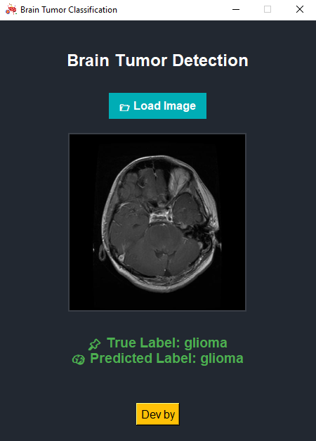
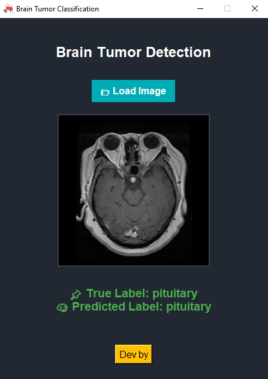

# 🧠 Brain Tumor Detection System (Desktop AI Assistant)

A professional **desktop application** that leverages deep learning to classify brain MRI images and detect tumors with high accuracy. Built using **TensorFlow** and wrapped in a **Tkinter GUI**, this lightweight and offline-capable AI tool is designed to support medical research and diagnostics.

> 📖 **License**: Licensed under the [MIT License](#-license)

---

## 💡 Overview

The system automatically analyzes brain MRI scans and classifies them into four categories:

- **Glioma Tumor**
- **Meningioma Tumor**
- **Pituitary Tumor**
- **No Tumor**

This tool assists medical professionals and researchers by providing fast, reliable predictions in a user-friendly offline environment.

---

During training, the system was configured to automatically save the best-performing model. The results are as follows:

## 🎯 Model Summary

| Metric                 | Value               |
|------------------------|---------------------|
| **Training Accuracy**  | 98.72%              |
| **Validation Accuracy**| 97.38%              |
| **Testing Accuracy**   | 97.33%              |
| **Model Architecture** | EfficientNetB2      |
| **Epochs**             | 25 + 15 (Fine-tuning)|
| **Macro AUC**          | 0.9981              |

The model demonstrates strong generalization and performance on unseen test data.

---

## 📈 Accuracy & Loss Curves

  

These plots represent the model’s training and validation performance over time.

---
## 📈 ROC

  

The ROC curves visualize the model’s classification performance across all classes, highlighting its ability to separate positive from negative instances.

---

## 📊 Confusion Matrix



The matrix highlights the model's classification performance across all four tumor types.

---

## 🧾 Classification Report

**Classes**: glioma, meningioma, notumor, pituitary

```
                precision    recall  f1-score   support

      glioma       0.99      0.93      0.96       300
  meningioma       0.93      0.96      0.95       306
     notumor       1.00      1.00      1.00       405
   pituitary       0.98      0.99      0.98       300

    accuracy                           0.97      1311
   macro avg       0.97      0.97      0.97      1311
weighted avg       0.97      0.97      0.97      1311
     
```

---

## 🖥️ Application UI



---

## 🧪 Test Examples

**Glioma**  


**Meningioma**  


**No Tumor**  


**Pituitary**  


---

## ✅ Features

- 📂 Load MRI images easily
- ⚡ Real-time prediction with instant feedback
- 🧠 Trained on high-quality brain MRI dataset
- 🎨 Modern and clean desktop UI (Tkinter-based)
- 📊 Visual results: predictions, confusion matrix, ROC curves
---

## ▶️ How to Run

### 1. Clone the Repository

```bash
git clone https://github.com/HoussemBouagal/Brain-Tumor-Classification.git
cd Brain-Tumor-Classification
```

### 2. Install Dependencies

```bash
pip install -r requirements.txt
```

### 3. Launch the Application

```bash
python main.py
```

---

## 🧪 Tech Stack

- **Language**: Python 3.x  
- **Frameworks**: TensorFlow, Keras  
- **Model**: EfficientNetB2 (pretrained + fine-tuned)  
- **Input Size**: 260x260 RGB  
- **GUI**: Tkinter  
- **Image Processing**: OpenCV, PIL, NumPy  

---

## 📦 Requirements

```txt

tensorflow >= 2.10.0
opencv-python
matplotlib
seaborn
pandas
numpy
scikit-learn
Pillow

```

---

## 🗂️ Project Structure

```
Brain-Tumor-Classification/
│
├── test/                        # Test dataset folders
│   ├── glioma/
│   ├── meningioma/
│   ├── notumor/
│   └── pituitary/
│
├── model/
│   └── brain_tumor_model.keras       # Trained model
│
├── assets/                     # Assets for UI & docs
│   ├── app_interface.jpg
│   ├── accuracy_curve.png
│   ├── confusion_matrix.png
│   ├── glioma.jpg 
│   ├── meningioma.jpg 
│   ├── notumor.jpg   
│   ├── pituitary.jpg 
│   └── roc_curve.png
│
├── main.py                     # Main application logic
├── brain-cancer.png            # Application icon
├── requirements.txt            # Required packages
├── LICENSE                     # MIT License
└── README.md                   # Documentation
```

---

## 📄 License

This project is licensed under the **MIT License**.

```
MIT License

Permission is hereby granted, free of charge, to any person obtaining a copy
of this software and associated documentation files (the “Software”), to deal
in the Software without restriction...
```

Read the full license in the [LICENSE](LICENSE) file.

---

## ⚠️ Disclaimer

> **This project is for educational and research purposes only.**  
> It is **not intended for clinical or diagnostic use**. Please consult certified medical professionals for real-world medical decisions.

---

## 👤 Author

**Houssem Bouagal**  
📧 Email: [mouhamedhoussem813@gmail.com](mailto:mouhamedhoussem813@gmail.com)  
🔗 LinkedIn: [Houssem Bouagal](https://www.linkedin.com/in/houssem-eddine-bouagal-98025a297)  
🌐 Portfolio: [houssembouagal.github.io/Portfolio/](https://houssembouagal.github.io/Portfolio/)
